# usdview

usdviewは、USD形式(usda/usdc/usdz)のファイルを開き、    
シーン階層と3Dビューを表示するビュワーアプリケーションです。    
USDの動作検証で使用できます。     
以下のようにコマンドラインで使用できます。    

    usdview xxxx.usda

第二引数にUSDファイル(usda/usdc/usdz)を指定します。    
usdviewが起動すると、以下のような表示になります。    

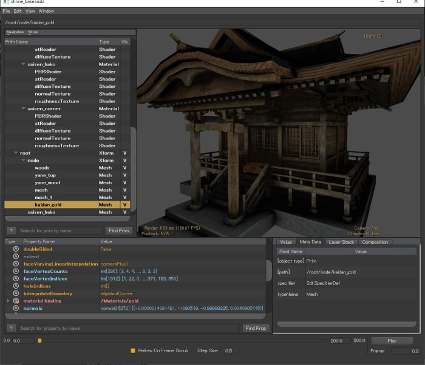   

## usdviewの機能

* USDファイルの階層構造を表示
* 3Dのビュワー
* 各要素で指定されているパラメータの表示
* アニメーションのプレビュー
* 各要素の表示/非表示の切り替え

また、機能拡張でIntelのCPUパストレーシングレンダラである「Embree」で確認することもできます。    

## ビュワーで未対応の機能

ビュワーで未対応の機能があります 。    

### USD 19.07

* 頂点法線が正しく反映されない
* 法線マップは反映されない ( https://github.com/PixarAnimationStudios/USD/issues/701 )。    
* Displacementマップは正しく反映されない ( https://github.com/PixarAnimationStudios/USD/issues/922 )。    
* Shader:UsdUVTextureの「inputs:scale」「inputs:bias」が反映されない。    
* UsdPreviewSurfaceのUsdUVTextureで、    
テクスチャのRGBにRoughness/metallic/Occlusionなどパックして、G/B/A要素を参照指定しても常にRが採用されてしまう。
* Shader:UsdTransform2dが反映されない。
* Materialで「Opacity < 1.0」の指定の場合は半透明になるが、全体的に正しく表示されない。
* 光源をUSDで指定している場合、SphereLightとRectLight以外は効かない。    

また、PBRマテリアルとしてMetallicを指定しても背景画像をIBL的に指定できるUIがないため、    
Metallicの確認には向きません。    

USD 19.11のusdviewでは、DomeLightをシーンに入れることでHDRIによるIBLが効きます。   
これでMetallicの確認ができますが、iorで映り込みも調整するようで(iorを0.0に近づけるほどMetallic効果がかかる)、Metallicのパラメータは見ていない ?

## Shading Modeの切り替え

メインメニューの「View」-「Shading Mode」で表示を切り替えることができます。    

* Wireframe    
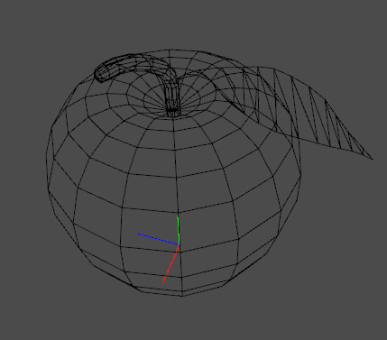   

* WireframeOnSurface    
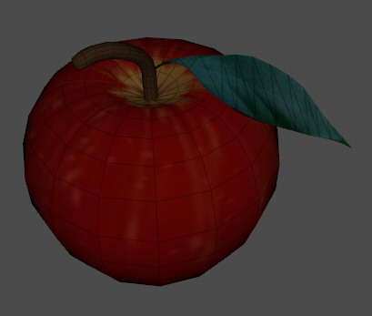   

* SmoothShaded    
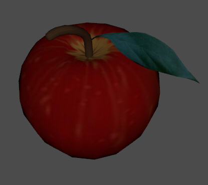   

* FlatShaded    
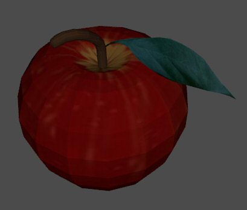   

* Points    
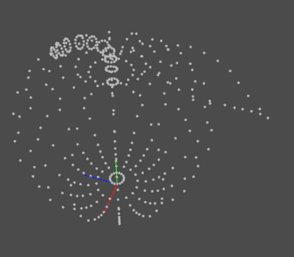   

* Geom Only    
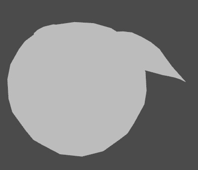   

* Geom Smooth    
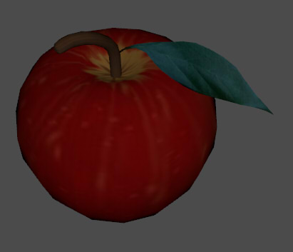   

* Geom Flat    
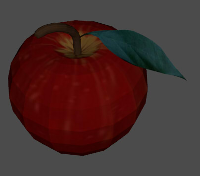   

* Hidden Surface Wireframe    
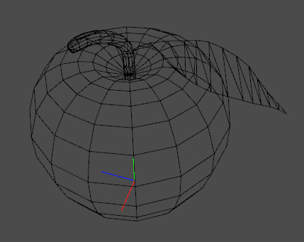   

## Subdivisionの確認 (Complexity)

Subdivisionはデフォルトの状態では確認できません。    
メインメニューの「View」-「Complexity」をLowからVery Highまで切り替えることで、Subdivisionの分割レベルを上げることができます。    
Sphereなどのプリミティブを指定した場合も、これを指定することでより滑らかにできます。    

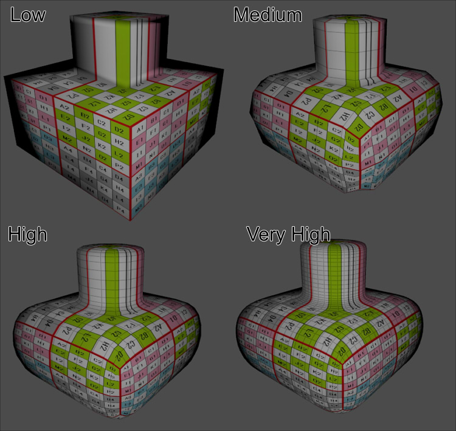   

## プレビューでの光源について

メインメニューの「View」-「Lights」で「Camera Light」を選択した場合は、    
常にカメラの正面から光源が当てることになります。    
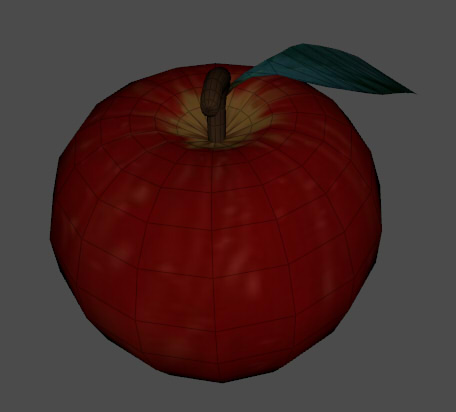   
別途「Camera Light」をOffにして、    
Key/Fill/Backの光源を与えることで、Roughnessなどを確認しやすくなります(USD 19.07)。   
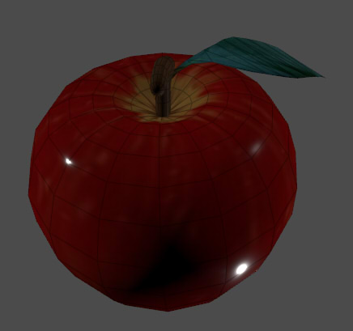   
USD 19.11のusdviewでは、Key/Fill/Backの選択はなく、代わりに「Dome Light」があります。    

USDファイル内に光源指定がある場合は、このデフォルト光源をすべてOffにしてチェックするのがよさそうです。    

## 頂点数や面数をチェック

メインメニューの「View」-「Head-Up Display」-「SubTree Info(Slow)」を選択してOnにすると、    
ビューの左上に選択された要素(Prim)の合計要素数や頂点数、面数が表示されます。    

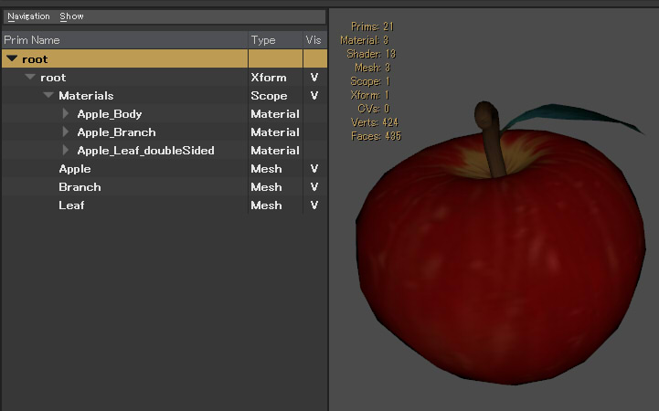   

## Embreeでの確認

Embreeが使えるようにビルドした場合、
もしくは [NVIDIAが提供しているUSD一式を使用している](../usd_nvidia.md) 場合、    
usdviewのメインメニューの「View」-「Hydra Renderer」-「Embree」を選択すると、    
Embreeのパストレーシングでのレンダリングが行われます。   
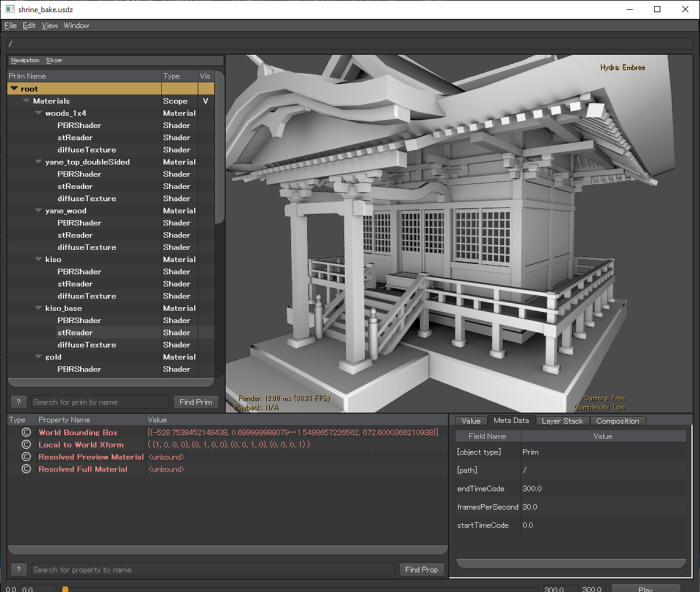   

ただし、未実装の機能があります (USD 19.07段階)。    

* Materialは反映されない。    
primvars:displayColorでの色は反映されます。    

