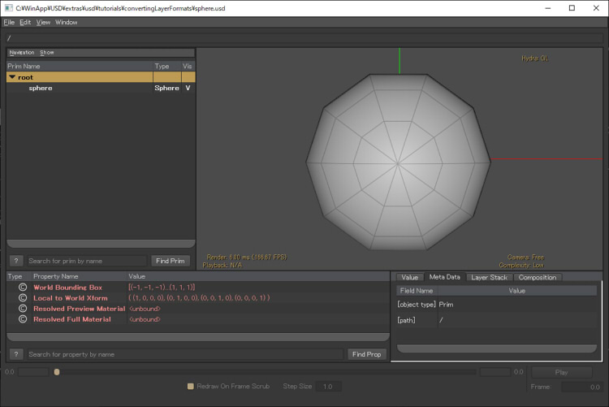

# USDのビルド (Win)

USD 19.07/19.11で動作確認しました。    

Windows環境でUSDの関連ファイルをビルドします。    
Windows 10環境で試しました。    
なお、Pythonを使用するビルドは、usdview/usdcat/usdzipなどのコマンドラインツールも作成されます。    
Pythonを使用しないビルドは、C++のアプリケーションで使用するPythonに依存しないライブラリとヘッダを作成します。    
ビルド自身では、どちらの場合もPython27を使用します。    

ビルド方法については、以下もご参照くださいませ。    

https://github.com/PixarAnimationStudios/USD

## USDのライブラリビルドで必要なモジュール

* Visual Studio 2017 (無償のCommunity版でOK)
* Python27 (ビルド時に必要。Python35では失敗しました)
* CMake
* NASM

## Visual Studio 2017のインストール

Visual Studio 2017以外では動作確認していません。    

https://visualstudio.microsoft.com/ja/vs/older-downloads/

より、Visual Studio Community 2017 をダウンロードしてインストールします。    

## Python27のインストール

https://www.python.org/downloads/windows/    
より「Python 2.7.16」の「Windows x86-64 MSI installer」を探してインストールします。    
「C:\Python27」にインストールしたとします。    
Pythonは、USDのビルド時に必要になります。    

## CMakeをインストール

CMake ( https://cmake.org/ )をダウンロードしてインストールします。    
「C:\Program Files\CMake」にインストールしたとします。     

## NASMをインストール

NASM ( http://www.nasm.us/ ) のWindows 64bit版をダウンロードしてインストールします。    
https://www.nasm.us/pub/nasm/releasebuilds/2.14.02/win64/     
でダウンロード。    

NASMはアセンブラのコンパイラです。    
「C:\Program Files\NASM」にインストールしたとします。    

## USDの関連ソースをダウンロード

https://github.com/PixarAnimationStudios/USD

より、v19.07のソースをダウンロードします。    
「C:\WinApp\USD」に展開したとします。    

## USDのビルド (Pythonを使用しない/C++ライブラリとして使用する場合)

この場合は、usdview/usdcat/usdzipなどのコマンドラインツールはビルドされません。    

スタートメニューより「Visual Studio 2017」-「VS2017用 x64 Native Tools コマンドプロンプト」を起動。    
これで、VS2017のビルドのパスが通ったコマンドプロンプトが起動します。   

以下のパスを通します。    

    set PATH=C:\Python27;C:\Python27\Scripts;%PATH%    
    set PATH=C:\Program Files\CMake\bin;%PATH%    
    set PATH=C:\Program Files\NASM;%PATH%    

Python/CMake/NASMのそれぞれのパスは、インストールしたときのものを指定します。    

以下で、USDの関連ファイルをビルドします。    
これは時間がかかります。    

    python C:\WinApp\USD\build_scripts\build_usd.py --no-python "C:\WinApp\USD\builds_no_python"    

この場合は、「C:\WinApp\USD」にUSDのファイルが展開されているとします。    
「--no-python」を指定することで、ビルドするライブラリはPythonを参照しなくて済むようになります。    
Pythonと切り離したライブラリ利用ができます。これにより、純粋にC++を使ったUSDのインポータやエクスポータ、ツール類を作成できます。     
なお、このビルドでは動的ライブラリを参照する形になります。    
「C:\WinApp\USD\builds_no_python」はビルドしたライブラリや関連ヘッダが格納されるフォルダです。     

ビルド結果として、    
「C:\WinApp\USD\builds_no_python\bin」に関連のdll類、    
「C:\WinApp\USD\builds_no_python\lib」に関連のdllとビルドで必要なライブラリ(lib)、Shaderファイル類が格納されます。    
「C:\WinApp\USD\builds_no_python\include」にヘッダファイルが格納されています。    

## USDのビルド (Pythonを使用)

### pipでpysideをインストール

コマンドプロンプトで以下のようにPython27のパスを通します。    

    set PATH=C:\Python27;C:\Python27\Scripts;%PATH%    

「pip install pyside」を実行します。    

    pip install pyside

### PyOpenGLをインストール

PythonでOpenGL実行できるようにするため、PyOpenGLをインストールします。    

    pip install PyOpenGL    
    pip install PyOpenGL_accelerate    

インストールに失敗する場合は、ググってください、、、

### USDのビルド

スタートメニューより「Visual Studio 2017」-「VS2017用 x64 Native Tools コマンドプロンプト」を起動。    
これで、VS2017のビルドのパスが通ったコマンドプロンプトが起動します。   

以下のパスを通します。    
 

    set PATH=C:\Python27;C:\Python27\Scripts;%PATH%    
    set PATH=C:\Program Files\CMake\bin;%PATH%    
    set PATH=C:\Program Files\NASM;%PATH%    

Python/CMake/NASMのそれぞれのパスは、インストールしたときのものを指定します。    

以下で、USDの関連ファイルをビルドします。    
これは時間がかかります。    

    python C:\WinApp\USD\build_scripts\build_usd.py "C:\WinApp\USD\builds"    

この場合は、「C:\WinApp\USD」にUSDのファイルが展開されているとします。    
このビルドでは動的ライブラリを参照する形になります。    
「C:\WinApp\USD\builds」はビルドしたライブラリや関連ヘッダが格納されるフォルダです。     

ビルド結果として、    
「C:\WinApp\USD\builds\bin」に関連のdll類と実行ファイル、    
「C:\WinApp\USD\builds\lib」に関連のdllとビルドで必要なライブラリ(lib)、Shaderファイル類が格納されます。    
「C:\WinApp\USD\builds\include」にヘッダファイルが格納されています。    

### 動作確認

新しいコマンドプロンプトを起動し、以下を実行します。    
バッチファイル化しておいたほうがいいかもしれません。    
「C:\WinApp\USD\builds」にUSDをビルドして生成されたファイル類が格納されているとします。    
※ これは、Pythonを使用するビルドを行った場合(build_usd.pyで--no-python を指定しなかった場合)の確認です。    

    set PATH=C:\Python27;C:\Python27\Scripts;%PATH%    
    set PYTHONPATH=C:\WinApp\USD\builds\lib\python     
    set PATH=C:\WinApp\USD\builds\bin;%PATH%;    
    set PATH=C:\WinApp\USD\builds\lib;%PATH%;    

Pythonのパスを通す必要があります。    
また、PYTHONPATHとPATHへの追加は必須です。     

以下を実行すると、「sphere.usd」の中身がusda形式で表示されます。    

    usdcat C:\WinApp\USD\extras\usd\tutorials\convertingLayerFormats\sphere.usd

正しくビルドされた場合は、以下のように表示されます。    

    #usda 1.0

    def Sphere "sphere"
    {
    }

次に、usdviewで確認します。以下を実行します。    

    usdview C:\WinApp\USD\extras\usd\tutorials\convertingLayerFormats\sphere.usd

正しくビルドされた場合は、以下のように表示されます。    

    

