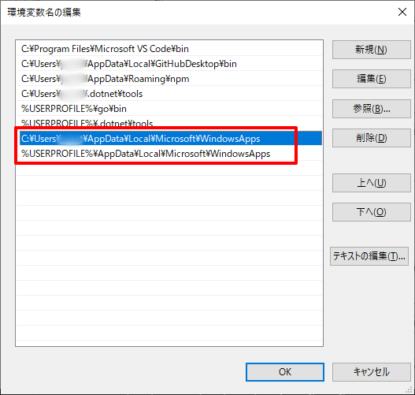

# USDのビルド (Win)

USD 21.11で動作確認しました。    

Windows環境でUSDの関連ファイルをビルドします。    
Windows 10環境で試しました。    
なお、Pythonを使用するビルドは、usdview/usdcat/usdzipなどのコマンドラインツールも作成されます。    
Pythonを使用しないビルドは、C++のアプリケーションで使用するPythonに依存しないライブラリとヘッダを作成します。    
ビルド自身では、どちらの場合もPython27もしくはPython39を使用します。    

ビルド方法については、以下もご参照くださいませ。    

https://github.com/PixarAnimationStudios/USD

## USDのライブラリビルドで必要なモジュール

* Visual Studio 2017 (無償のCommunity版でOK)
* Python 2.7もしくはPython 3.9
* CMake
* NASM

Python2/Python3のどちらを使うかですが、    
文字コードの表現（文字列パラメータやファイルパスでのUTF-8の使用）でPython3の機能を使っている箇所があるようなので、
Python3を使うほうがよいと思われます。      
Python2/Python3の両方のインストールを試したため、そのことを記載しています。    

ただし、**Python 3.10では「pyside2」がインストールできないためPython 3.9を使用**します。      

## Visual Studio 2017のインストール

Visual Studio 2017以外では動作確認していません。    

https://visualstudio.microsoft.com/ja/vs/older-downloads/

より、Visual Studio Community 2017 をダウンロードしてインストールします。    

## CMakeをインストール

CMake ( https://cmake.org/ )をダウンロードしてインストールします。    
「C:\Program Files\CMake」にインストールしたとします。     

## NASMをインストール

NASM ( http://www.nasm.us/ ) のWindows 64bit版をダウンロードしてインストールします。    
https://www.nasm.us/pub/nasm/releasebuilds/2.14.02/win64/     
でダウンロード。    

NASMはアセンブラのコンパイラです。    
「C:\Program Files\NASM」にインストールしたとします。    

## USDの関連ソースをダウンロード

https://github.com/PixarAnimationStudios/USD

より、v21.11のソースをダウンロードします。    
「C:\WinApp\USD」に展開したとします。    

## Python27を使用する場合

以下は、Python27を使う場合です。     

### Python27のインストール

https://www.python.org/downloads/windows/    
より「Python 2.7.16」の「Windows x86-64 MSI installer」を探してインストールします。    
「C:\Python27」にインストールしたとします。    
Pythonは、USDのビルド時に必要になります。    

### pipでpysideをインストール

コマンドプロンプトで以下のようにPython27のパスを通します。    

    set PATH=C:\Python27;C:\Python27\Scripts;%PATH%    

「pip install pyside」を実行します。    

    pip install pyside

### PyOpenGLをインストール

PythonでOpenGL実行できるようにするため、PyOpenGLをインストールします。    

    pip install PyOpenGL    
    pip install PyOpenGL_accelerate    

インストールに失敗する場合は、ググってください、、、

### USDのビルド (Pythonを使用しない/C++ライブラリとして使用する場合)

この場合は、usdview/usdcat/usdzipなどのコマンドラインツールはビルドされません。    

スタートメニューより「Visual Studio 2017」-「VS2017用 x64 Native Tools コマンドプロンプト」を起動。    
これで、VS2017のビルドのパスが通ったコマンドプロンプトが起動します。   

以下のパスを通します。    

    set PATH=C:\Python27;C:\Python27\Scripts;%PATH%    
    set PATH=C:\Program Files\CMake\bin;%PATH%    
    set PATH=C:\Program Files\NASM;%PATH%    

Python/CMake/NASMのそれぞれのパスは、インストールしたときのものを指定します。    

以下で、USDの関連ファイルをビルドします。    
これは時間がかかります。    

    python C:\WinApp\USD\build_scripts\build_usd.py --no-python "C:\WinApp\USD\builds_no_python"    


この場合は、「C:\WinApp\USD」にUSDのファイルが展開されているとします。    
「--no-python」を指定することで、ビルドするライブラリはPythonを参照しなくて済むようになります。    
Pythonと切り離したライブラリ利用ができます。これにより、純粋にC++を使ったUSDのインポータやエクスポータ、ツール類を作成できます。     
なお、このビルドでは動的ライブラリを参照する形になります。    
「C:\WinApp\USD\builds_no_python」はビルドしたライブラリや関連ヘッダが格納されるフォルダです。     


ビルド結果として、    
「C:\WinApp\USD\builds_no_python\bin」に関連のdll類、    
「C:\WinApp\USD\builds_no_python\lib」に関連のdllとビルドで必要なライブラリ(lib)、Shaderファイル類が格納されます。    
「C:\WinApp\USD\builds_no_python\include」にヘッダファイルが格納されています。    

## Python3を使用する場合

以下は、Python3を使う場合です。     

### Python3のインストール

https://pythonlinks.python.jp/ja/index.html

より「Python 3.9.9」の「Windows x86-64 MSI installer」を探してインストールします。    
「C:\Python39」にインストールしたとします。    
Pythonは、USDのビルド時に必要になります。    

python-3.9.9-amd64.exeをダウンロードしてインストールします。      
「C:\Python39」にインストールしたしたとします。    
※ **Python 3.10では「pyside2」がインストールできないため1つ前のバージョンに**しています。     

### Python39のパスを通す

コマンドプロンプトを起動し、以下のようにパスを通します。     
```
set PATH=C:\Python39;C:\Python39\Scripts;%PATH%
```

「C:\Python39」がPythonのインストールフォルダです。      
「python –version」としてPythonのバージョンを確認するようにしてください。       

### パスを通したのに、Pythonのバージョンが3.9ではない場合

コマンドプロンプト上で、カレントパスをcdで変えて別のフォルダに移動したとき、
「python –version」を実行すると異なるバージョンが表示される場合があります。    
Windows 10のバージョンアップの影響か、OSの環境変数のパスの優先順が変更されてしまう場合があるようです。      
これはWindowsに同梱のPythonが先に検索されるのが原因として考えられそうです。      
「where python」でどのpythonが呼び出されてるか確認するようにします。      
もし、「C:\Python39」ではない場合は次の手順で環境変数のPATHを編集します。     

OSの「設定」-「システム」-「詳細情報」-「システムの詳細情報」を選択し、
「システムのプロパティ」ダイアログボックスを表示します。     
「環境変数」ボタンを押し、「ユーザー環境変数」のPATHを編集します。     

     

「C:\Users\UserName\AppData\Local\Microsoft\WindowsApps」「%USERPROFILE%\AppData\Local\Microsoft\WindowsApps」がこのPATHの先頭になっている場合があります。     
その場合は下に移動させてください。      

### pipをバージョンアップ

念のため、以下を実行してpipをバージョンアップします。     
```
python.exe -m pip install --upgrade pip
```

### pipでpyside2をインストール

Python3ではpysideではなくpyside2を使用します。       
また、pyside2はPython 3.10ではインストールできません。そのため、Python 3.9を使っています。       

コマンドプロンプトで以下を実行します。     
```
pip install pyside2
```

### PyOpenGLをインストール

```
pip install PyOpenGL
pip install PyOpenGL_accelerate
```

### USDのビルド (Pythonを使用しない/C++ライブラリとして使用する場合)

この場合は、usdview/usdcat/usdzipなどのコマンドラインツールはビルドされません。    

スタートメニューより「Visual Studio 2017」-「VS2017用 x64 Native Tools コマンドプロンプト」を起動。    
これで、VS2017のビルドのパスが通ったコマンドプロンプトが起動します。   

以下のパスを通します。    
```
set PATH=C:\Python39;C:\Python39\Scripts;%PATH%
set PYTHONPATH=C:\Python39\Lib\site-packages
set PATH=C:\Program Files\CMake\bin;%PATH%
set PATH=C:\Program Files\NASM;%PATH%
```
「PYTHONPATH」の指定を入れないとPyOpenGL/PySide2が検索できず、うまくいかないようでした。      

Python/CMake/NASMのそれぞれのパスは、インストールしたときのものを指定します。    

以下で、USDの関連ファイルをビルドします。    
これは時間がかかります。    

```
python C:\WinApp\USD\build_scripts\build_usd.py --no-python "C:\WinApp\USD\builds_no_python"    
```

この場合は、「C:\WinApp\USD」にUSDのファイルが展開されているとします。    
「--no-python」を指定することで、ビルドするライブラリはPythonを参照しなくて済むようになります。    
Pythonと切り離したライブラリ利用ができます。これにより、純粋にC++を使ったUSDのインポータやエクスポータ、ツール類を作成できます。     
なお、このビルドでは動的ライブラリを参照する形になります。    
「C:\WinApp\USD\builds_no_python」はビルドしたライブラリや関連ヘッダが格納されるフォルダです。     

ビルド結果として、    
「C:\WinApp\USD\builds_no_python\bin」に関連のdll類、    
「C:\WinApp\USD\builds_no_python\lib」に関連のdllとビルドで必要なライブラリ(lib)、Shaderファイル類が格納されます。    
「C:\WinApp\USD\builds_no_python\include」にヘッダファイルが格納されています。    

## USDのビルド (Pythonを使用)

### USDのビルド

スタートメニューより「Visual Studio 2017」-「VS2017用 x64 Native Tools コマンドプロンプト」を起動。    
これで、VS2017のビルドのパスが通ったコマンドプロンプトが起動します。   

Python27使用時は、以下のパスを通します。    
 
```
set PATH=C:\Python27;C:\Python27\Scripts;%PATH%    
set PATH=C:\Program Files\CMake\bin;%PATH%    
set PATH=C:\Program Files\NASM;%PATH%    
```

Python39使用時は、以下のパスを通します。    
```
set PATH=C:\Python39;C:\Python39\Scripts;%PATH%
set PYTHONPATH=C:\Python39\Lib\site-packages    
set PATH=C:\Program Files\CMake\bin;%PATH%    
set PATH=C:\Program Files\NASM;%PATH%    
```
「PYTHONPATH」の指定を追加しています。      

Python/CMake/NASMのそれぞれのパスは、インストールしたときのものを指定します。    

以下で、USDの関連ファイルをビルドします。    
これは時間がかかります。    

    python C:\WinApp\USD\build_scripts\build_usd.py --openimageio "C:\WinApp\USD\builds"    


この場合は、「C:\WinApp\USD」にUSDのファイルが展開されているとします。    
このビルドでは動的ライブラリを参照する形になります。    
「C:\WinApp\USD\builds」はビルドしたライブラリや関連ヘッダが格納されるフォルダです。     
「--openimageio」を指定することで、usdviewでDomeLight使用時の背景(hdr/exrファイルで指定)が反映できるようになります。     

ビルド結果として、    
「C:\WinApp\USD\builds\bin」に関連のdll類と実行ファイル、    
「C:\WinApp\USD\builds\lib」に関連のdllとビルドで必要なライブラリ(lib)、Shaderファイル類が格納されます。    
「C:\WinApp\USD\builds\include」にヘッダファイルが格納されています。    

「--no-python」を指定しないデフォルトのUSDのビルドの場合は、      
このUSDにアクセスするdllがPythonに依存することになります。      
この場合は、バージョンを合わせたPythonを環境にあらかじめインストールしておかないと動作しません。     


### 動作確認

新しいコマンドプロンプトを起動し、以下を実行します。    
バッチファイル化しておいたほうがいいかもしれません。    
「C:\WinApp\USD\builds」にUSDをビルドして生成されたファイル類が格納されているとします。    
※ これは、Pythonを使用するビルドを行った場合(build_usd.pyで--no-python を指定しなかった場合)の確認です。    

Python27使用時は、以下のパスを通します。    
```
set PATH=C:\Python27;C:\Python27\Scripts;%PATH%    
set PYTHONPATH=C:\WinApp\USD\builds\lib\python     
set PATH=C:\WinApp\USD\builds\bin;%PATH%;    
set PATH=C:\WinApp\USD\builds\lib;%PATH%;    
```

Python39使用時は、以下のパスを通します。    
```
set PATH=C:\Python39;C:\Python39\Scripts;%PATH%
set PYTHONPATH=C:\WinApp\USD\builds\lib\python;C:\Python39\Lib\site-packages    
set PATH=C:\WinApp\USD\builds\bin;%PATH%;    
set PATH=C:\WinApp\USD\builds\lib;%PATH%;    
```
「PYTHONPATH」の指定で「C:\Python39\Lib\site-packages」も追加しています。      

Pythonのパスを通す必要があります。    
また、PYTHONPATHとPATHへの追加は必須です。     

以下を実行すると、「sphere.usd」の中身がusda形式で表示されます。    

    usdcat C:\WinApp\USD\extras\usd\tutorials\convertingLayerFormats\sphere.usd

正しくビルドされた場合は、以下のように表示されます。    

    #usda 1.0

    def Sphere "sphere"
    {
    }

次に、usdviewで確認します。以下を実行します。    

    usdview C:\WinApp\USD\extras\usd\tutorials\convertingLayerFormats\sphere.usd

正しくビルドされた場合は、以下のように表示されます。    

    

