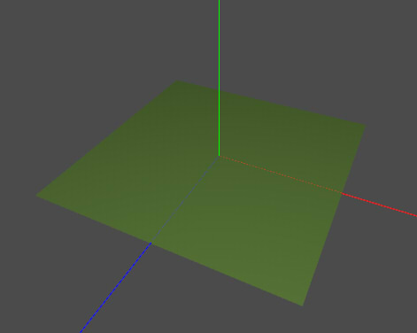
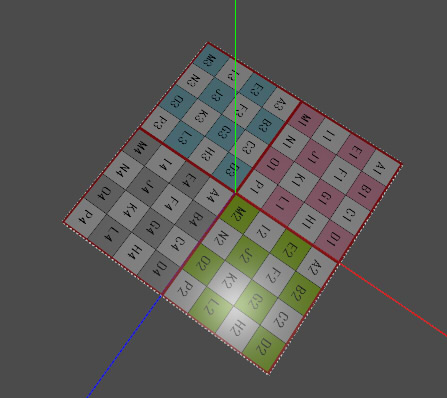
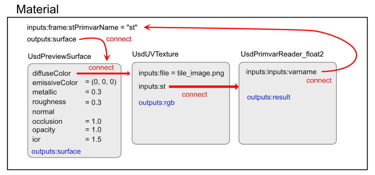

# Materialの作成

マテリアルの仕様は以下が参考になります。    
「UsdPreviewSurface Proposal」    
https://graphics.pixar.com/usd/docs/UsdPreviewSurface-Proposal.html    

はじめにC++での記述例とusda出力について書き、その後に構成や各パラメータについて説明していきます。　　　　

## Material情報を指定

### C++での記述

ヘッダ部は以下の指定を行っています。    

    #include "pxr/usd/usd/stage.h"
    #include "pxr/usd/usdGeom/xform.h"
    #include "pxr/usd/usdGeom/mesh.h"
    
    #include "pxr/usd/usdShade/material.h"
    #include "pxr/usd/usdShade/shader.h"
    
    #include <vector>
    
    using namespace PXR_INTERNAL_NS;

「[Meshを作成](./usd_create_mesh.md)」のコードの「stage->Save()」の前に以下を記載するとします。    
「prim(型はUsdPrim)」がMesh情報とします。    

    // "material_0"のマテリアルを作成.
    UsdPrim primMat = stage->DefinePrim(SdfPath("/hello/material_0"), TfToken("Material"));
    UsdShadeMaterial mat(primMat);
    
    // PBR Shaderの作成.
    UsdPrim primShader = stage->DefinePrim(SdfPath("/hello/material_0/PBRShader"), TfToken("Shader"));
    UsdShadeShader shader(primShader);
    
    shader.CreateIdAttr().Set(TfToken("UsdPreviewSurface"));
    
    shader.CreateInput(TfToken("diffuseColor"), SdfValueTypeNames->Color3f).Set(GfVec3f(0.5f, 0.9f, 0.2f));
    shader.CreateInput(TfToken("roughness"), SdfValueTypeNames->Float).Set(0.3f);
    shader.CreateInput(TfToken("metallic"), SdfValueTypeNames->Float).Set(0.3f);
    
    // UVの接続.
    mat.CreateInput(TfToken("frame:stPrimvarName"), SdfValueTypeNames->Token).Set(TfToken("st"));
    
    // MaterialからShaderをつなぐ.
    mat.CreateSurfaceOutput().ConnectToSource(shader, TfToken("surface"));
    
    // マテリアルをprimの形状にバインド.
    mat.Bind(prim);

### usdaでの出力

実行すると、以下の”xxxx.usda”が出力されます。    

    #usda 1.0
    
    def Xform "hello"
    {
        def Mesh "mesh"
        {
            uniform bool doubleSided = 0
            int[] faceVertexCounts = [4]
            int[] faceVertexIndices = [0, 1, 2, 3]
            normal3f[] normals = [(0, 1, 0), (0, 1, 0), (0, 1, 0), (0, 1, 0)]
            point3f[] points = [(-1, 0, -1), (-1, 0, 1), (1, 0, 1), (1, 0, -1)]
            texCoord2f[] primvars:st = [(0, 0), (1, 0), (1, 1), (0, 1)] (
                interpolation = "varying"
            )
            uniform token subdivisionScheme = "none"
            rel material:binding = </hello/material_0>
        }

        def Material "material_0"
        {
            token inputs:frame:stPrimvarName = "st"
            token outputs:surface.connect = </hello/material_0/PBRShader.outputs:surface>
    
            def Shader "PBRShader"
            {
                uniform token info:id = "UsdPreviewSurface"
                color3f inputs:diffuseColor = (0.5, 0.9, 0.2)
                float inputs:metallic = 0.3
                float inputs:roughness = 0.3
                token outputs:surface
            }
        }
    }

usdviewで見ると以下のようになります。     
    

形状（ジオメトリ）からマテリアルの参照は「rel material:binding = </hello/material_0>」のようにパス指定になります。    
「def Material "material_0"」にマテリアル情報を記載しています。    
「def Shader “PBRShader”」でマテリアルのパラメータを指定。    
「uniform token info:id = “UsdPreviewSurface”」としてつなげることで、
PBRマテリアルに沿ったパラメータ指定を行うことになります。    

## テクスチャを割り当てる

### C++での記述

diffuseColorなどのマテリアルのパラメータに対して、テクスチャイメージの情報を接続(connect)することで、
任意のテクスチャを与えることができます。    
「[Meshを作成](./usd_create_mesh.md)」のコードの「stage->Save()」の前に以下を記載するとします。    
「prim(型はUsdPrim)」がMesh情報とします。    
diffuseColorのテクスチャとして外部ファイルの「tile_image.png」を指定しています。    

    UsdPrim primMat = stage->DefinePrim(SdfPath("/hello/material_0"), TfToken("Material"));
    UsdShadeMaterial mat(primMat);

    // Shaderの作成.
    UsdPrim primShader = stage->DefinePrim(SdfPath("/hello/material_0/PBRShader"), TfToken("Shader"));
    UsdShadeShader shader(primShader);

    shader.CreateIdAttr().Set(TfToken("UsdPreviewSurface"));

    shader.CreateInput(TfToken("roughness"), SdfValueTypeNames->Float).Set(0.3f);
    shader.CreateInput(TfToken("metallic"), SdfValueTypeNames->Float).Set(0.3f);

    // Texture Samplerの指定。UV読み込みのReaderとセットで指定している.
    UsdPrim primReader = stage->DefinePrim(SdfPath("/hello/material_0/stReader"), TfToken("Shader"));
    UsdShadeShader shaderReader(primReader);
    shaderReader.CreateIdAttr().Set(TfToken("UsdPrimvarReader_float2"));

    UsdPrim primDiffuseTexture = stage->DefinePrim(SdfPath("/hello/material_0/diffuseTexture"), TfToken("Shader"));
    UsdShadeShader shaderDiffuseTexture(primDiffuseTexture);

    shaderDiffuseTexture.CreateIdAttr().Set(TfToken("UsdUVTexture"));

    // diffuseTextureのファイル名を指定.
    shaderDiffuseTexture.CreateInput(TfToken("file"), SdfValueTypeNames->Asset).Set(SdfAssetPath("tile_image.png"));

    // UVのためのReaderと接続.
    shaderDiffuseTexture.CreateInput(TfToken("st"), SdfValueTypeNames->Float2).ConnectToSource(shaderReader, TfToken("result"));

    // DiffuseTextureをshaderのdiffuseColorにマッピング.
    shader.CreateInput(TfToken("diffuseColor"), SdfValueTypeNames->Color3f).ConnectToSource(shaderDiffuseTexture, TfToken("rgb"));

    // UVの接続.
    UsdShadeInput stInput = mat.CreateInput(TfToken("frame:stPrimvarName"), SdfValueTypeNames->Token);
    stInput.Set(TfToken("st"));

    // DiffuseTextureに割り当てるUVを接続.
    shaderReader.CreateInput(TfToken("varname"), SdfValueTypeNames->Token).ConnectToSource(stInput);

    // MaterialからShaderをつなぐ.
    mat.CreateSurfaceOutput().ConnectToSource(shader, TfToken("surface"));

    // マテリアルをprimの形状にバインド.
    mat.Bind(prim);

これを実行すると、以下のようなusdaファイルが出力されます。    

### usdaでの出力

    #usda 1.0

    def Xform "hello"
    {
        def Mesh "mesh"
        {
            uniform bool doubleSided = 0
            int[] faceVertexCounts = [4]
            int[] faceVertexIndices = [0, 1, 2, 3]
            rel material:binding = </hello/material_0>
            normal3f[] normals = [(0, 1, 0), (0, 1, 0), (0, 1, 0), (0, 1, 0)]
            point3f[] points = [(-1, 0, -1), (-1, 0, 1), (1, 0, 1), (1, 0, -1)]
            texCoord2f[] primvars:st = [(0, 0), (1, 0), (1, 1), (0, 1)] (
                interpolation = "varying"
            )
        }

        def Material "material_0"
        {
            token inputs:frame:stPrimvarName = "st"
            token outputs:surface.connect = </hello/material_0/PBRShader.outputs:surface>

            def Shader "PBRShader"
            {
                uniform token info:id = "UsdPreviewSurface"
                color3f inputs:diffuseColor.connect = </hello/material_0/diffuseTexture.outputs:rgb>
                float inputs:metallic = 0.3
                float inputs:roughness = 0.3
                token outputs:surface
            }

            def Shader "stReader"
            {
                uniform token info:id = "UsdPrimvarReader_float2"
                token inputs:varname.connect = </hello/material_0.inputs:frame:stPrimvarName>
                float2 outputs:result
            }

            def Shader "diffuseTexture"
            {
                uniform token info:id = "UsdUVTexture"
                asset inputs:file = @tile_image.png@
                float2 inputs:st.connect = </hello/material_0/stReader.outputs:result>
                float3 outputs:rgb
            }
        }
    }

usdviewでは以下のように表示されます。    
    

Materialの構成については後述します。    

## Materialの構成とパラメータ

### 参考

* https://graphics.pixar.com/usd/docs/api/usd_preview_surface_8h.html    
* https://graphics.pixar.com/usd/docs/UsdPreviewSurface-Proposal.html

### Materialの構成

以下のようなdiffuseColorにテクスチャを割り当てたusdaを例に記載します。    

    def Material "material_0"
    {
        token inputs:frame:stPrimvarName = "st"
        token outputs:surface.connect = </hello/material_0/PBRShader.outputs:surface>

        def Shader "PBRShader"
        {
            uniform token info:id = "UsdPreviewSurface"
            color3f inputs:diffuseColor.connect = </hello/material_0/diffuseTexture.outputs:rgb>
            float inputs:metallic = 0.3
            float inputs:roughness = 0.3
            token outputs:surface
        }

        def Shader "stReader"
        {
            uniform token info:id = "UsdPrimvarReader_float2"
            token inputs:varname.connect = </hello/material_0.inputs:frame:stPrimvarName>
            float2 outputs:result
        }

        def Shader "diffuseTexture"
        {
            uniform token info:id = "UsdUVTexture"
            asset inputs:file = @tile_image.png@
            float2 inputs:st.connect = </hello/material_0/stReader.outputs:result>
            float3 outputs:rgb
        }
    }

    

ジオメトリ(Mesh)からMaterialへの参照は「rel material:binding = </hello/material_0>」の箇所で指定しています。    

Materialは複数のShaderで構成されています。    
Shaderは「uniform token info:id」により識別名を指定します。    

UsdPreviewSurfaceにPBRマテリアルのパラメータを指定します。    
ここでは定数を指定します。    

テクスチャを貼る場合は、「connect」で「UsdUVTexture」のShaderにつなぎます。    
「UsdUVTexture」でテクスチャファイルの指定と、UV情報への接続を行います。    
この「UsdUVTexture」は、UsdPreviewSurfaceの単一の定数値を、    
接続したテクスチャのピクセル値として反映する処理部になります。    

「UsdPrimvarReader_float2」はUV1への参照になります。    
最終的には"st"という名前のMeshのUV要素に接続します。   
"st"は、「def Mesh "mesh"」の「texCoord2f[] primvars:st」の要素にアクセスすることになります。    

また、UsdUVTextureからUsdPrimvarReader_float2に接続する間に「UsdTransform2d」を入れることで、    
テクスチャのUV値を直前で移動/回転/スケール変換させることができます。    

### PBRマテリアル(UsdPreviewSurface)のパラメータ

MaterialはPBRマテリアルの指定を行います。    

|要素名|使用要素|内容|    
|---|---|---|    
|diffuseColor|RGB|BaseColor(Albedo)相当。RGB値またはテクスチャを指定|    
|emissiveColor|RGB|発光色のRGB値またはテクスチャを指定|    
|metallic|グレイスケール|メタリック。映り込み具合。 float値またはグレイスケールテクスチャを指定|    
|roughness|グレイスケール|ラフネス。表面のざらつき。 float値またはグレイスケールテクスチャを指定|    
|normal|RGB|法線マップテクスチャを指定|    
|occlusion|グレイスケール|オクルージョンテクスチャを指定|    
|opacity|グレイスケール|不透明度をfloat値またはグレイスケールテクスチャで指定。 1.0で完全不透明（デフォルト）。 0.0で完全透明。|    
|ior|float値のみ?|屈折率を指定。デフォルト1.5。|    

その他、clearcoat/clearcoatRoughness/displacementなどがあります。    

まだ途中、、、     
