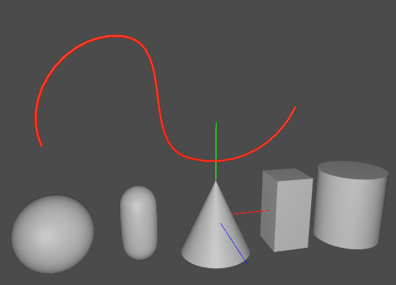

# 使用できるジオメトリ

参考 : https://graphics.pixar.com/usd/docs/api/usd_geom_page_front.html    

一般的なメッシュのほか、いくつかのプリミティブやNURBSに対応しています。    

|ジオメトリ(Prim)の種類|クラス名|説明|    
|---|---|---|    
|Mesh|UsdGeomMesh|メッシュ|
|NurbsPatch|UsdGeomNurbsPatch|NURBSパッチ|
|BasisCurves|UsdGeomBasisCurves|曲線（bezier/catmullRom/bsplineから選択）|
|NurbsCurves|UsdGeomNurbsCurves|NURBSカーブ|
|Points|UsdGeomPoints|点群。パーティクル表現などで使用|
|Capsule|UsdGeomCapsule|カプセル形状のプリミティブ|
|Cone|UsdGeomCone|円錐形状のプリミティブ|
|Cube|UsdGeomCube|直方体形状のプリミティブ|
|Cylinder|UsdGeomCylinder|円柱形状のプリミティブ|
|Sphere|UsdGeomSphere|球形状のプリミティブ|

以下は、usdviewで表示した例です。    
プリミティブとBasisCurvesの曲線を表示しました。    
曲線は分割を使用するため、メインメメニューの「View」-「Complexity」をLowからHighやVery Highなどに変更する必要があります。    

## iOS12/iOS13/iPadOS13での対応

Mesh/Capsule/Cone/Cube/Cylinder/Sphereを渡せることを確認しています。    
曲線(BasisCurves)は反映されないようです。    
