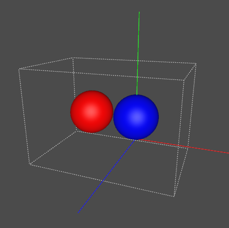

# MeshやXformの移動/回転/スケールを指定

MeshやXformなどの形状は、それぞれに対して「移動」「回転」「スケール」情報を与えることができます。     
また、別途アニメーション用のキーフレーム情報を与えることができます。    

## 位置だけを指定

### C++での記述

    #include "pxr/usd/usd/stage.h"
    #include "pxr/usd/usdGeom/xform.h"
    #include "pxr/usd/usdGeom/sphere.h"
    #include <vector>
    
    using namespace PXR_INTERNAL_NS;
    
    //-----------------------------------------.
    UsdStageRefPtr stage = UsdStage::CreateNew("xxxx.usda");

    UsdPrim node1 = stage->DefinePrim(SdfPath("/hello"), TfToken("Xform"));
    UsdPrim sphere = stage->DefinePrim(SdfPath("/hello/sphere"), TfToken("Sphere"));
    
    // 位置を指定.
    UsdGeomXformOp transOp = UsdGeomXform(node1).AddTranslateOp(UsdGeomXformOp::PrecisionFloat);
    transOp.Set(GfVec3f(0.1f, 0.5f, 0.2f));
    
    stage->Save();

### usdaでの出力

実行すると、以下のように出力されます。    

    #usda 1.0
    
    def Xform "hello"
    {
        float3 xformOp:translate = (0.1, 0.5, 0.2)
        uniform token[] xformOpOrder = ["xformOp:translate"]
    
        def Sphere "sphere"
        {
        }
    }

位置を指定している箇所で、「UsdGeomXform(node1).AddTranslateOp」でTranslateの要素を追加します。    
この際に、「UsdGeomXformOp::PrecisionFloat」でfloat型を指定します。    
この他に「UsdGeomXformOp::PrecisionDouble」も存在します。    
Precisionの指定に対応したVec3（ここではfloatなので「GfVec3f」）で
「transOp.Set」で値を格納しています。    

## 位置/回転/スケールを指定

### C++での記述

Translateの次に、回転（rotateXYZ）とスケール（scale）を指定しています。    

    // 位置を指定.
    {
      UsdGeomXformOp transOp = UsdGeomXform(node1).AddTranslateOp(UsdGeomXformOp::PrecisionFloat);
      transOp.Set(GfVec3f(0.1f, 0.5f, 0.2f));
    }
    
    // 回転（度数）を指定.
    {
      UsdGeomXformOp transOp = UsdGeomXform(node1).AddRotateXYZOp(UsdGeomXformOp::PrecisionFloat);
      transOp.Set(GfVec3f(0, 0, 45));
    }
    
    // スケールを指定.
    {
      UsdGeomXformOp transOp = UsdGeomXform(node1).AddScaleOp(UsdGeomXformOp::PrecisionFloat);
      transOp.Set(GfVec3f(1.5f, 1, 1));
    }

### usdaでの出力

実行すると、以下のように出力されます。    

    #usda 1.0
    
    def Xform "hello"
    {
        float3 xformOp:rotateXYZ = (0, 0, 45)
        float3 xformOp:scale = (1.5, 1, 1)
        float3 xformOp:translate = (0.1, 0.5, 0.2)
        uniform token[] xformOpOrder = ["xformOp:translate", "xformOp:rotateXYZ", "xformOp:scale"]
    
        def Sphere "sphere"
        {
        }
    }

これは、"hello"のノードがスケール、回転、移動、の順に行われます。    

## 階層構造で指定した場合

これらのスケール、回転、移動の変換は、階層構造のノードの場合は累積されます。    

以下のようなusdaファイルを記述します。     

    #usda 1.0
    
    def Xform "sphere1"
    {
        double3 xformOp:translate = (0, 0.5, 0)
        uniform token[] xformOpOrder = ["xformOp:translate"]
    
        def Sphere "sphere1"
        {
            color3f[] primvars:displayColor = [(0, 0, 1)]
            double radius = 0.5
        }
    
        def Xform "sphere2"
        {
            double3 xformOp:translate = (-1.0, 0.0, 0)
            uniform token[] xformOpOrder = ["xformOp:translate"]
    
            def Sphere "sphere2"
            {
                color3f[] primvars:displayColor = [(1, 0, 0)]
                double radius = 0.5
            }
        }
    }

これをusdviewで見ると以下のようになります。    
    

