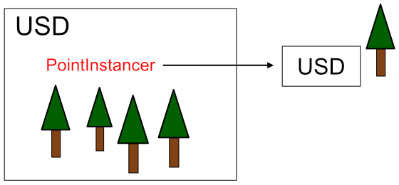

# USDとスケーラブル

USDで表現できることの特長的な機能を列挙し、    
USDを使うと何ができるのか、他の3Dモデルのフォーマットと比較したときの大きな違いについて書いていきます。     

usda/usd/usdcなどのUSDファイルについては、[USDファイルの構成](./usd_files_desc.md)もご参照くださいませ。     

## USDの特長的な機能

これ以外にもありますが、スケーラブルに絞って特長的な機能を列挙します。     

* 参照 (Reference)
* レイヤ (Layer)
* 切り替え (Variant)

## 参照 (Reference)

USDの大きな特徴として、USDファイルを参照していくことができます。      
    

usdaファイルでは以下のように記述します。      

```
    def "simpleSphere" (
        instanceable = false
        prepend references = @./simpleSphere.usd@
    )
    {
        float3 xformOp:rotateXYZ = (0, 0, 0)
        float3 xformOp:scale = (0.3, 0.3, 0.3)
        double3 xformOp:translate = (37.3, 16.6, -24.0)
        uniform token[] xformOpOrder = ["xformOp:translate", "xformOp:rotateXYZ", "xformOp:scale"]
    }
```
この場合は、「prepend references」の指定で別ファイルである「simpleSphere.usd」読み込み、位置とスケールを与えています。      
参照を入れ子にすることができ、これによりメインシーン(usd)から「アセット」としてそれぞれのusdを参照し、シーン構造自身を拡張していくことが可能になります。     
この参照の仕組みにより、**スケーラブル**な構成を簡単に実装できます。     

以下の画像は、NVIDIA Omniverse(データ構造としてUSDを使用している)の例です。     
    
参照先はusdファイルだけでなく、テクスチャの画像ファイルも含まれます。     
また、このシーンではクラウドであるAWS上のファイルも参照しています。     
このように、ローカルファイルだけではなくネット上(Web上)のファイルも参照してくることが可能です。     
これはOmniverseの機能ではなく、「**USD自身がスケーラブル**」であるというデータ構造としての大きな特徴になります。      

### PointInstancer

参照の一種として、「PointInstancer」というものがあります。     
    

これは、1つのusdファイルを参照して複数の位置、回転、スケールを配列として与えて複製する機能を提供します。      
たとえば、木々の表現などに適しています。      
    

usdaでは以下のように記述します。     

```
    def "shapes"
    {
        def PointInstancer "pointInstancer"
        {
            quath[] orientations = [
                (-0.68457, 0.68457, -0.177002, -0.177002),
                (-0.185791, 0.185791, 0.682129, 0.682129),
                (0.158691, -0.158691, 0.688965, 0.688965)]
            
            point3f[] positions = [
                (-298.60382, 0, -173.71628),
                (-31.865063, 0, -147.33672),
                (116.37445, 0, -159.18837)]

            float3[] scales = [
                (1, 1, 1),
                (1, 1, 1),
                (1, 1, 1)]

            int[] protoIndices = [0, 0, 0]
            prepend rel prototypes = </World/shapes/pointInstancer/asset>

            def Xform "asset" (
                kind = "component"
                prepend references = @./tree_01.usd@
            )
            {
            }
        }
    }
```
この場合はtree_01.usdを3つの位置/回転/スケールで複製して配置しています。      
同一のアセットを参照するため、数が増えてもメモリ効率がよいというメリットがあります。     

## レイヤ (Layer)

レイヤを用いることで、シーンを複数のusdファイルで構成することができます。      
    

USDファイルのヘッダ部で「subLayers」を指定することにより、シーン構造に指定のUSDファイルを追加できます。     

```
#usda 1.0
(
    subLayers = [
        @./sphere.usda@,
        @./ground.usd@,
        @./assets.usd@
    ]
)
```
この場合、レイヤとして用意した各USDファイルが結合された状態で
1つの階層構造として表示されることになります。     
分類に使用できる機能です。     
「レイヤ」と「参照」のどちらを使うか、というのはUSDのドキュメントの以下のURLが参考になりそうです。       

https://graphics.pixar.com/usd/release/usdfaq.html?highlight=sublayers#i-have-some-layers-i-want-to-combine-should-i-use-sublayers-or-references

サブレイヤ化したり結合(Flattenと呼ぶ)作業が、レイヤを使うほうが簡単に行えます。     

## 切り替え (Variant)

Variantを使うことで、1つの形状を切り替えて表示することができます。     
以下は、椅子Chair1/Chair2/Chair3を用意しそれぞれに参照としてusdファイルを指定しています。     
    
「variantSet」でこの参照を列挙し、「variantGroup = "Chair3"」としてどれを参照するか、というのを指定しています。     

```
    def Xform "Chair" (
        variants = {
            string variantGroup = "Chair3"
        }
        prepend variantSets = "variantGroup"
    )
    {
        double3 xformOp:rotateXYZ = (0, 0, 0)
        double3 xformOp:scale = (1, 1, 1)
        double3 xformOp:translate = (75.099, 0, 0)
        uniform token[] xformOpOrder = ["xformOp:translate", "xformOp:rotateXYZ", "xformOp:scale"]
        variantSet "variantGroup" = {
            "Chair1" {
                def "Jennings_Chair" (
                    instanceable = false
                    prepend references = @./chair_01.usd@
                )
                {
                }
            }
            "Chair2" {
                def "EastRural_Chair" (
                    instanceable = false
                    prepend references = @./chair_02.usd@
                )
                {
                }
            }
            "Chair3" {
                def "Chair_Array" (
                    instanceable = false
                    prepend references = @./chair_03.usd@
                )
                {
                }
            }
        }
    }
```
これを使用することで、配置の候補としてモックなど複数用意して仮配置しておき、
後で入れ替えるというのが容易になります。     
