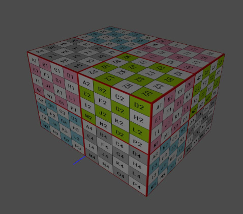

# USDの内部構成 (usda)

ここでは、ASCII形式のusdaファイルを例にして、おおまかなUSDの内部構成について記載します。    
内容の詳しい説明は別途で記載することにします。    

以下の直方体のMeshを配置し、テクスチャを割り当てています。    
以下はusdviewでの表示になります。    
    
バイナリファイルであるusdcの場合も、構成は同じになります。    

## simpleCube.usda

    #usda 1.0
    (
        defaultPrim = "root"
        doc = "simpleCube"
    )
    
    def Xform "root"
    {
        def Scope "Materials"
        {
            def Material "mat1"
            {
                token inputs:frame:stPrimvarName = "st"
                token outputs:surface.connect = </root/Materials/mat1/PBRShader.outputs:surface>

                def Shader "PBRShader"
                {
                    uniform token info:id = "UsdPreviewSurface"
                    color3f inputs:diffuseColor.connect = </root/Materials/mat1/diffuseTexture.outputs:rgb>
                    float inputs:ior = 1
                    float inputs:metallic = 0
                    float inputs:opacity = 1
                    float inputs:roughness = 0.4
                    token outputs:surface
                }
    
                def Shader "stReader"
                {
                    uniform token info:id = "UsdPrimvarReader_float2"
                    token inputs:varname.connect = </root/Materials/mat1.inputs:frame:stPrimvarName>
                    float2 outputs:result
                }
    
                def Shader "diffuseTexture"
                {
                    uniform token info:id = "UsdUVTexture"
                    asset inputs:file = @tile_image.jpg@
                    float2 inputs:st.connect = </root/Materials/mat1/stReader.outputs:result>
                    token inputs:wrapS = "repeat"
                    token inputs:wrapT = "repeat"
                    color3f outputs:rgb
                }
            }
        }
    
        def Mesh "mesh1"
        {
            int[] faceVertexCounts = [4, 4, 4, 4, 4, 4]
            int[] faceVertexIndices = [1, 3, 2, 0, 5, 7, 6, 4, 22, 10, 8, 20, 18, 14, 11, 23, 16, 12, 15, 19, 21, 9, 13, 17]
            rel material:binding = </root/Materials/mat1>
            normal3f[] normals = [(0, -1, 0), (0, -1, 0), (0, -1, 0), (0, -1, 0), (0, 1, 0), (0, 1, 0), (0, 1, 0), (0, 1, 0), (-1, 0, 0), (0, 0, 1), (-1, 0, 0), (0, 0, -1), (1, 0, 0), (0, 0, 1), (0, 0, -1), (1, 0, 0), (1, 0, 0), (0, 0, 1), (0, 0, -1), (1, 0, 0), (-1, 0, 0), (0, 0, 1), (-1, 0, 0), (0, 0, -1)]
            point3f[] points = [(-2.5, 0, 2), (-2.5, 0, -2), (2.5, 0, 2), (2.5, 0, -2), (2.5, 3, 2), (2.5, 3, -2), (-2.5, 3, 2), (-2.5, 3, -2), (-2.5, 0, 2), (-2.5, 0, 2), (-2.5, 0, -2), (-2.5, 0, -2), (2.5, 0, 2), (2.5, 0, 2), (2.5, 0, -2), (2.5, 0, -2), (2.5, 3, 2), (2.5, 3, 2), (2.5, 3, -2), (2.5, 3, -2), (-2.5, 3, 2), (-2.5, 3, 2), (-2.5, 3, -2), (-2.5, 3, -2)]
            texCoord2f[] primvars:st = [(0, 1), (0, 0), (1, 0), (1, 1), (0, 1), (0, 0), (1, 0), (1, 1), (0, 1), (0, 0), (1, 0), (1, 1), (0, 1), (0, 0), (1, 0), (1, 1), (0, 1), (0, 0), (1, 0), (1, 1), (0, 1), (0, 0), (1, 0), (1, 1)] (
                interpolation = "faceVarying"
            )
            int[] primvars:st:indices = [0, 1, 2, 3, 4, 5, 6, 7, 8, 9, 10, 11, 12, 13, 14, 15, 16, 17, 18, 19, 20, 21, 22, 23]
            uniform token subdivisionScheme = "none"
        }
    }

ここでは、Meshのキューブを配置し、マテリアルを指定している例になります。    
"/root/mesh1"がMeshデータ、"/root/Materials/mat1"がMaterialデータになります。    

### ヘッダ部 (ルートレイヤ部)

USDの開始ヘッダ部は「#usda 1.0」の記載から始まります。    
「defaultPrim = "root"」はUSDファイル内のルートとなる形状を指定。    
これは、複数のUSDファイル(usda/usdc)から参照される場合に必要となります。    
単一USDファイルで扱う場合は必要ありません。    
「doc = "simpleCube"」はUSDファイルの説明などを文字列で指定します。省略できます。    

### パス

すべての形状は「パス(Path)」で階層内の任意の位置が決まります。    
以下の記述の場合、"/root/mesh1"がMeshのパスになります。    
同一のパス名を持つことはできません。    

    def Xform "root"
    {
        def Mesh "mesh1"
        {
        }
    }

パスの区切り記号は "/" になります。     
「def Xform "root"」と記載されている3つめが形状名（ネームスペース名）となり、この階層構造がパスとなります。    
絶対パスで指定する場合は、"/root/mesh1"のように"/"から記載します。    

### 形状名に指定できるもの

ASCII文字列を指定できますが、英字か数字、一部の記号のみのようです。    
a～ｚ、A～Z、0-9、_  は安全に使用できました。    
ただし、形状名の先頭で数字を指定できません。     

### タイプ (Type name)

「def Xform "root"」と記載されている2つめのがタイプになります。    
「Xform」が他のDCCツールでのノード相当のもの、     
「Mesh」がMesh情報、    
「Material」がマテリアル情報、を表します。     

### 外部参照

"/root/Materials/mat1/diffuseTexture"の「asset inputs:file = @tile_image.jpg@」の箇所で、    
外部のjpeg画像ファイルを参照しています。    
この外部参照部は、「@images/tile_image.jpg@」のようにフォルダ指定もできます。    
この場合は、AssetPathとしてパス指定することになります。    
USDの構造でのパスとは異なる点に注意してください。    

