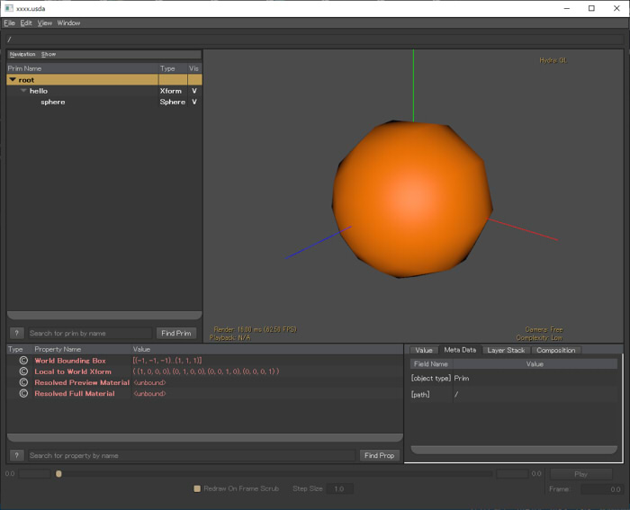

# USDのライブラリを使ったC++プログラムを書く (Win)

USDのライブラリを使ってC++プログラムを書く際の導入です。    
USD 19.07段階の覚書きです。    
Visual Studio 2017でC++でプログラムを行います。     

## ビルドに必要なプロジェクト設定

「C:\WinApp\USD\builds_no_python」にビルドしたUSD関連ファイルが格納されているとします。    
USDのビルドについては「[USDのビルド (Win)](../doc/usd_build_win.md)」をご参照くださいませ。     

### include検索パス

* C:\WinApp\USD\builds_no_python\include\boost-1_65_1
* C:\WinApp\USD\builds_no_python\include

### lib検索パス

* C:\WinApp\USD\builds_no_python\lib

### libに追加するもの

|libファイル|補足説明|
|---|---|
|pcp.lib||
|sdf.lib|SdfPathなどで使用|
|vt.lib|VtVec3fArrayなどで使用|
|gf.lib|GfVec3fなどで使用|
|tf.lib|TfTokenなどで使用|
|usd.lib|必須|
|usdGeom.lib|ジオメトリ用。UsdGeomXformOp/UsdGeomMeshなどで使用|
|usdShade.lib|MaterialのShader用。UsdShadeMaterial/UsdShadeShaderなどで使用|
|usdSkel.lib|Skeleton割り当て用。UsdSkelRoot/UsdSkelSkeletonなどで使用|

usdXXXX.libは、必要な場合に追加します。    
他、以下のようなものがあります。    

|libファイル|補足説明|
|---|---|
|usdLux.lib|光源用。UsdLuxRectLight/UsdLuxSphereLightなどで使用|

## ヘッダの書き換え

ビルドエラーになる箇所を補正。    

pxr/usd/pcp/types.hの    

    constexpr size_t PCP_INVALID_INDEX = std::numeric_limits<size_t>::max();

の前に以下を入れます。    

    #undef max

## サンプルソース

ヘッダ部は以下の記載を行います。    

    #include "pxr/usd/usd/stage.h"
    #include "pxr/usd/usdGeom/xform.h"
    #include "pxr/usd/usdGeom/sphere.h"
    
    // GfRotation で使用.
    #include "pxr/base/gf/rotation.h"  

    // GfMatrix4f で使用.
    #include "pxr/base/gf/matrix4f.h"  
    
    #include <vector>
    
    // 以下のnamespace内に、UsdXXXXのクラスがある.
    using namespace PXR_INTERNAL_NS;

以下のソースで、球を指定してxxxx.usdaファイルを出力します。    

    // Stageからシーン構築は開始される.
    // 第一引数は出力ファイル名.
    UsdStageRefPtr stage = UsdStage::CreateNew("xxxx.usda");
    
    // 「/hello/sphere」のPrimを作成.
    stage->DefinePrim(SdfPath("/hello"), TfToken("Xform"));
    UsdPrim sphere = stage->DefinePrim(SdfPath("/hello/sphere"), TfToken("Sphere"));
    
    // 半径を指定.
    sphere.GetAttribute(TfToken("radius")).Set(1.5);

    // displayColorを指定 (usdviewで表示されるとりあえずの色指定).
    std::vector<GfVec3f> colorList;
    colorList.push_back(GfVec3f(1.0f, 0.2f, 0.0f));
    UsdGeomGprim(sphere).GetDisplayColorAttr().Set(VtVec3fArray(colorList.begin(), colorList.end()));
    
    // ファイルに保存.
    stage->Save();

これをビルドします。

## 実行する

実行前に以下のパスを通します。    

    set PATH=C:\WinApp\USD\builds_no_python\bin;%PATH%;    
    set PATH=C:\WinApp\USD\builds_no_python\lib;%PATH%;  

「[USDのライブラリを使ったプログラムを実行 (Win)](../doc/usd_run_lib_win.md)」もご参照くださいませ。    

実行すると、以下の内容の「xxxx.usda」ファイルが出力されます。    

    #usda 1.0
    
    def Xform "hello"
    {
        def Sphere "sphere"
        {
            color3f[] primvars:displayColor = [(1, 0.2, 0)]
            double radius = 1.5
        }
    }

## usdviewで確認

これをusdviewで見ると、以下のように表示されます。    
    
