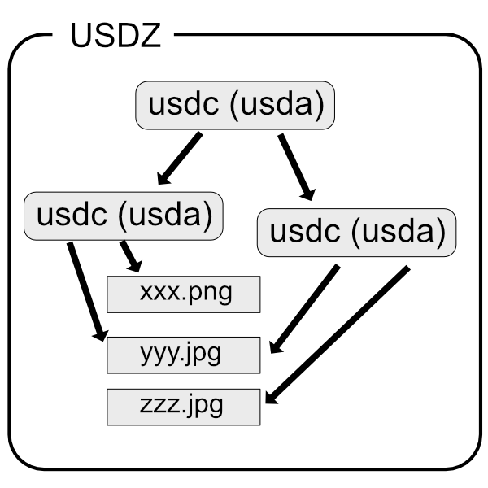

# USDファイルの構成

以下のファイルで構成されます。     

|ファイル拡張子|説明|    
|---|---|    
|usda|USDのシーンファイル (ASCII形式)|    
|usdc|USDのシーンファイル (バイナリ形式)|    
|jpg/png|参照しているテクスチャイメージ|    
|usdz|usda(usdc)とテクスチャイメージを1つのファイルにまとめてzipにしたもの。zip圧縮はされません。|    

usdaとusdcは相互変換でき、ASCIIのテキスト形式(usda)かバイナリ(usdc)か、の違いだけで内容は同じになります。    
usdcのほうがファイルサイズを小さくできます。    

    

USDファイルは入れ子構造にでき、シーンのUSDファイルから1つの形状情報が入ったUSDファイルを参照する、ということができます。    
これにより、特定の形状のモックを作成し後で入れ替えるという操作が容易になります。   
これらの構造を1つのUSDZファイルにまとめることができます。    

USDファイルの内容については「[USDの内部構成(usda)](./usd_usda.md)」をご参照ください。    
